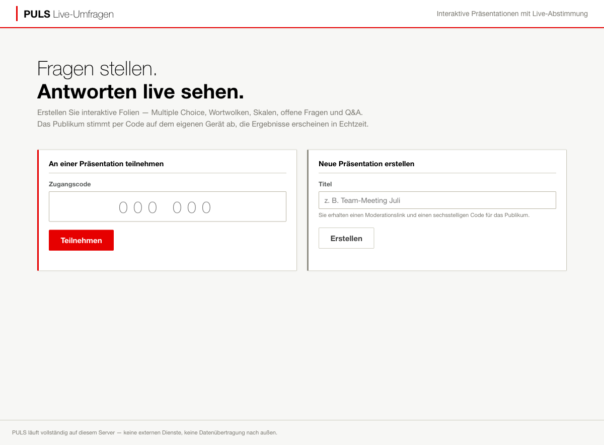
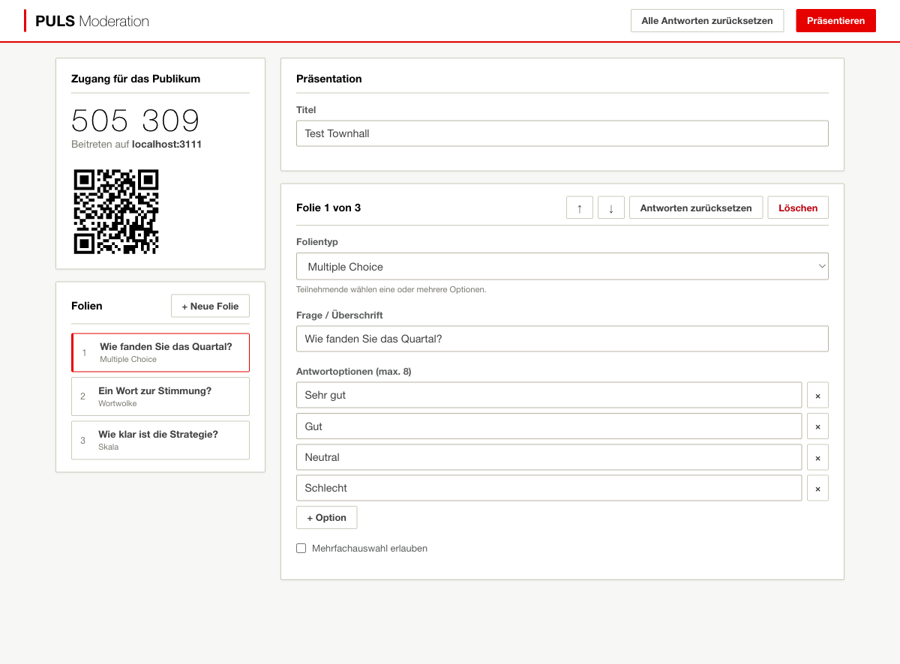
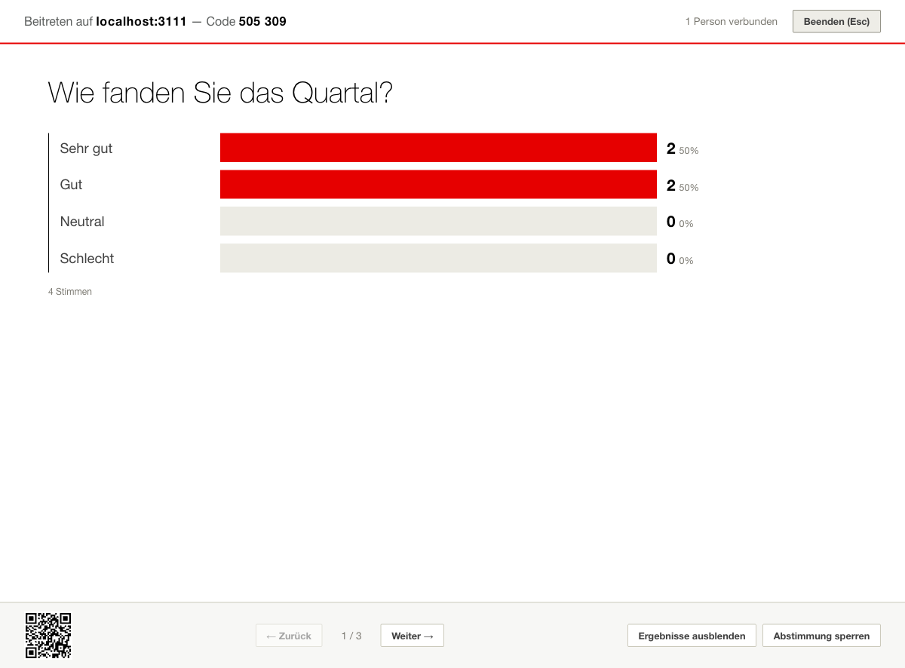
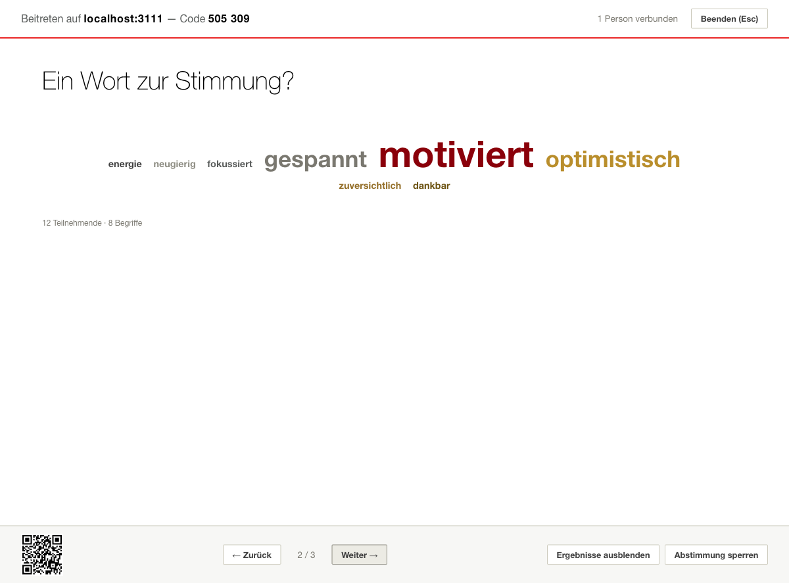
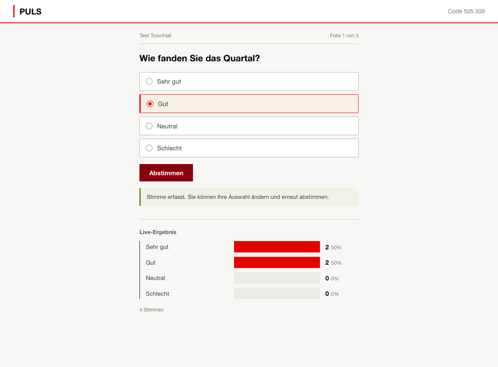
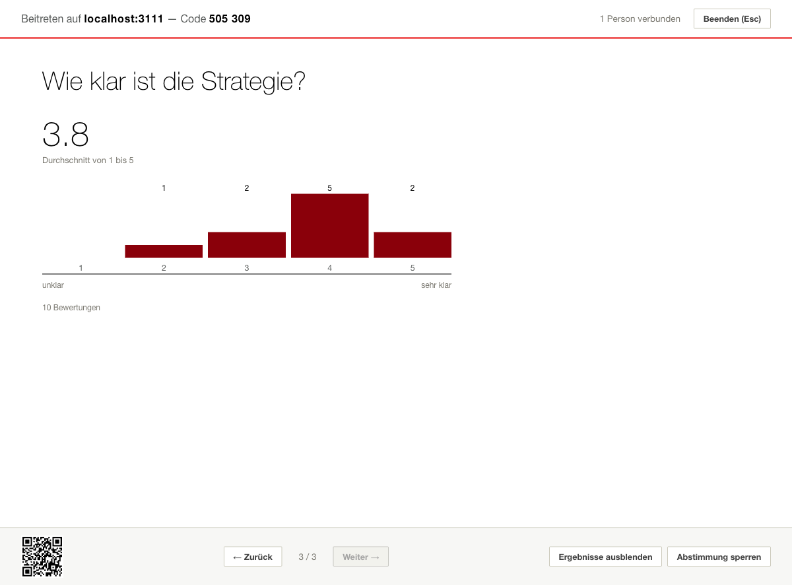

# PULS — Live-Umfragen (Mentimeter-Alternative)

Selbst-gehostete Alternative zu Mentimeter: interaktive Präsentationen mit Live-Abstimmung.
Das Publikum tritt per sechsstelligem Code oder QR-Code bei und stimmt auf dem eigenen Gerät ab —
die Ergebnisse erscheinen in Echtzeit auf der Präsentationsfläche.

Gestaltet nach dem Corporate-Designsystem (Global Banking): Weiß dominiert, Corporate Red
nur als Akzent, Diagramme in Bordeaux, Frutiger-Schriftstapel, keine Rundungen, keine Verläufe.

## Funktionen

| Folientyp | Beschreibung |
|---|---|
| Multiple Choice | Eine oder mehrere Optionen (max. 8), Live-Balkendiagramm |
| Wortwolke | 1–3 Begriffe pro Person, Wolke wächst live |
| Offene Frage | Freitext-Antworten als Antwort-Wand (max. 5 pro Person) |
| Skala | Bewertung 1–5/6/7/10 mit Durchschnitt und Verteilung |
| Q&A | Publikum reicht Fragen ein und wählt sie hoch |
| Infofolie | Statischer Text ohne Interaktion |

Außerdem: Moderations-Steuerung (Folienwechsel, Abstimmung sperren, Ergebnisse ausblenden,
Antworten zurücksetzen), Live-Teilnehmerzähler, QR-Code für den Beitritt, Tastatursteuerung
im Präsentationsmodus (←/→, Esc), Persistenz über Neustarts.

## Start

Voraussetzung: **Node.js ≥ 18** — sonst nichts. Keine npm-Pakete, kein Build-Schritt, keine externen Dienste.

```bash
node server.js            # Standard: Port 3000
PORT=8080 node server.js  # eigener Port
```

Dann im Browser `http://localhost:3000` öffnen:

1. **Präsentation erstellen** → Sie landen im Editor (der Moderationslink mit Token wird zusätzlich
   unter „Meine Präsentationen" im Browser gespeichert).
2. Folien anlegen — Änderungen werden automatisch gespeichert.
3. **Präsentieren** klicken → Vollbildmodus mit Live-Ergebnissen.
4. Das Publikum öffnet `http://<ihre-maschine>:3000` und gibt den Code ein —
   oder scannt den QR-Code (Kurz-URL `http://<ihre-maschine>:3000/<code>` funktioniert ebenfalls).

**Beitritt per Handy:** `localhost` funktioniert nur auf dem eigenen Rechner. Handys erreichen
den Server über die LAN-IP (gleiches WLAN vorausgesetzt) — der Presenter erkennt das selbst:
Ist er über `localhost` geöffnet, zeigen QR-Code und Beitrittszeile automatisch die
LAN-Adresse des Servers (`/api/server-info`). Beim ersten Start fragt macOS ggf., ob `node`
eingehende Verbindungen annehmen darf — zulassen. In Gäste-/Firmen-WLANs kann
Client-Isolation Verbindungen zwischen Geräten blockieren.

## Architektur

```
server.js            Zero-Dependency Node.js-Server (http, fs, crypto)
                     REST-API + Server-Sent Events (SSE) für Echtzeit
data/store.json      Persistenz (automatisch, atomisches Schreiben)
public/
  index.html         Startseite: beitreten / erstellen
  presenter.html     Editor + Vollbild-Präsentationsmodus
  vote.html          Publikums-Ansicht (mobile-first)
  common.js          API-Client, SSE-Reconnect, Ergebnis-Renderer
  design-system.css  Corporate-Designsystem (Kopie aus dem Arbeitsordner)
  app.css            App-Styles auf Basis des Designsystems
  vendor/qrcode.js   QR-Generator (MIT, lokal — kein CDN)
```

**Entscheidungen mit Blick auf restriktive Umgebungen (z. B. UBS):**

- **Null Abhängigkeiten** — kein `npm install`, kein Zugriff auf npm-Registry nötig.
- **Keine externen Ressourcen** — keine CDNs, Fonts oder Tracker; alles wird vom eigenen Server ausgeliefert.
- **SSE statt WebSockets** — Server-Sent Events sind gewöhnliches HTTP und kommen deutlich
  zuverlässiger durch Corporate-Proxies und Firewalls; Heartbeat alle 25 s hält Verbindungen offen.
- **Frutiger-Schriftstapel** — auf UBS-Rechnern greift die installierte Frutiger, sonst Helvetica/Arial.
- **Anonyme Teilnahme** — keine Anmeldung, keine personenbezogenen Daten; Teilnehmer erhalten
  nur eine zufällige Browser-ID (localStorage) zur Duplikat-Vermeidung.

## Sicherheit & Grenzen

- Moderations-Aktionen sind durch ein zufälliges Token geschützt (im Moderationslink enthalten —
  Link nicht weitergeben). Publikum kann ausschließlich antworten.
- Eingaben werden serverseitig begrenzt und clientseitig escaped (kein HTML-Injection über Antworten).
- Kein HTTPS eingebaut: Im Firmennetz hinter einen Reverse-Proxy (IIS/nginx/F5) mit TLS legen
  oder nur im vertrauten Netzsegment betreiben.
- Ein-Prozess-Design mit In-Memory-Zustand: bewusst einfach gehalten, für Meetings/Townhalls
  bis einige hundert Teilnehmende ausgelegt — nicht für mandantenfähigen Dauerbetrieb.
- „Meine Präsentationen" liegt im Browser-localStorage: Moderationslink sichern, wenn der
  Browserwechsel möglich sein soll.

## Betrieb in der UBS-Umgebung

Realistischste Optionen, aufsteigend nach Aufwand:

1. **Lokal am eigenen Rechner** (Meetingraum/Townhall): `node server.js` starten, Teilnehmende
   im selben Netz verbinden sich über `http://<hostname>:3000`. Voraussetzung: Node.js ist
   installiert bzw. als genehmigte Software verfügbar und die lokale Firewall lässt den Port zu.
2. **Interner Server/VM**: Ordner kopieren, als Dienst starten (z. B. `systemd` oder Task Scheduler),
   Reverse-Proxy mit TLS und internem DNS-Namen davor — dann funktioniert auch der QR-Beitritt elegant.
3. **Interne Container-Plattform**: Das Projekt ist trivial containerisierbar
   (`FROM node:22-alpine`, `COPY . .`, `CMD ["node","server.js"]`, Volume für `./data`).

Vorher mit IT-Security klären (Shadow-IT-Richtlinien); da keine Daten das Haus verlassen und
keine Fremdpakete enthalten sind, ist die Prüfgrundlage überschaubar: ~600 Zeilen Server-Code,
vollständig lesbar.

## Screenshots

| | |
|---|---|
|  |  |
|  |  |
|  |  |

## API (Kurzreferenz)

```
POST   /api/presentations                 { title } → { id, code, adminToken }
GET    /api/join/:code                    Präsentation per Code finden
GET    /api/presentations/:id             öffentlicher Snapshot (mit ?token= Admin-Vollansicht)
GET    /api/presentations/:id/stream      SSE-Livestream (?role=audience|presenter)
POST   /api/presentations/:id/answers     { slideId, participantId, value }
POST   /api/presentations/:id/upvote      { slideId, participantId, questionId }
PUT    /api/presentations/:id             Titel ändern (Admin)
PUT    /api/presentations/:id/slides      Folien ersetzen (Admin)
POST   /api/presentations/:id/state       { activeIndex, votingLocked, resultsHidden } (Admin)
POST   /api/presentations/:id/reset       Antworten löschen (Admin)
DELETE /api/presentations/:id             Präsentation löschen (Admin)
```
